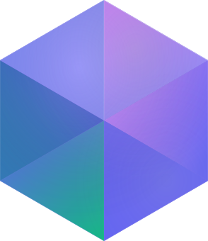

<p align="center" style="padding-top:20px">



### Your space to connect

Tungstn is a client for [Matrix](https://matrix.org) focused on providing a faster iteration cycle over Commet. Featuring rich experience while maintaining a familiar interface. The goal is to build a secure, privacy respecting app without compromising on the features you have come to expect from a modern chat client. World class voice chat, modern chat features. Nothing locked behind paywalls, no tolerance for enshittification.

# Features

- Supports **Windows**, **Linux**, and **Android** and **Web** (MacOS and iOS planned in future)
- End to End Encryption
- Familiar UI
- World class Voice Chat and Streaming
- Custom Emoji + Stickers
- GIF picker that can use any Tenor compatible endpoint (self hosting possible)
- Threads
- Encrypted Room Search
- Multiple Accounts
- Spaces
- Emoji verification & cross signing
- Push Notifications
- URL Preview
- oEmbed support
- rich privacy settings

<details><summary><b>PGP Public Key to verify executables</b></summary>

```
-----BEGIN PGP PUBLIC KEY BLOCK-----

mDMEabygNhYJKwYBBAHaRw8BAQdAQrZ7jsAvxD6mAXUHv9OJ/d4IxdSZdLv18xX1
RDDzNYC0LVR1bmdzdG4uQ2hhdCBDb2RlIFNpZ25pbmcgPGluZm9AdHVuZ3N0bi5j
aGF0PoiQBBMWCgA4FiEEF+xXNZus6cYz0ozDJTipggYFkqIFAmm8oDYCGwMFCwkI
BwIGFQoJCAsCBBYCAwECHgECF4AACgkQJTipggYFkqIWDwEA2E9LdiozzISH64SC
kvgquZeOKoaY0ZWq7Snt4hejZWEBAKjU5ThCRv29WJNq/IZGwvvRwiv+d+VlLhih
2OZVxr8IuDgEabygNhIKKwYBBAGXVQEFAQEHQBva5+ncDvb37TL1FM+r+doeHHb1
QeHxMo+5sCpu6O9LAwEIB4h4BBgWCgAgFiEEF+xXNZus6cYz0ozDJTipggYFkqIF
Amm8oDYCGwwACgkQJTipggYFkqLagwD/XTlL86THDqybiRyMLLGLkyuaYEndgA1S
jtzzoh7QJAcA/15HU10uT4/ikw18NSiGj0hf/rHJPbGL+oGRb/19Q7MA
=grvA
-----END PGP PUBLIC KEY BLOCK-----
```

</details>

# Development

Tungstn is built using [Flutter](https://flutter.dev), currently v3.41.1

This repo currently has a monorepo structure, containing two flutter projects: Tungstn and Tiamat. Tungstn is the main client, and Tiamat is a sort of wrapper around Material with some extra goodies, which is used to maintain a consistent style across the app. Tiamat may eventually be moved to its own repo, but for now it is maintained here for ease of development.

## Building

### 1. [Install Flutter](https://docs.flutter.dev/get-started/install)

### 2. Install Libraries

Tungsnt requires some additional libraries to be built

```bash
sudo apt-get install -y ninja-build libgtk-3-dev libmpv-dev mpv ffmpeg libmimalloc-dev
```

### 3. Fetch Dependencies

You will need to change directory in to tungstn, then fetch dependencies

```bash
cd tungstn
flutter pub get
```

### 4. Code Generation

We make use of procedural code generation in some parts of tungstn. As a rule, generated code will not be checked in to git, and will need to be generated before building.

To run code generation, run the script within the `tungstn` directory:
`dart run scripts/codegen.dart`

### 5. Building

When building tungstn, there are some additional command line arguments that must be used to configure the build.

**Required**

| **Argument** | **Valid Values**                                                          | **Description**                                                             |
| ------------ | ------------------------------------------------------------------------- | --------------------------------------------------------------------------- |
| PLATFORM     | 'desktop', 'mobile', 'linux', 'windows', 'macos', 'android', 'ios', 'web' | Defines which platform to build for                                         |
| BUILD_MODE   | 'release', 'debug'                                                        | When building with 'debug' flag, additional debug information will be shown |

**Optional**

| **Argument** | **Valid Values** | **Description**                                                                                              |
| ------------ | ---------------- | ------------------------------------------------------------------------------------------------------------ |
| GIT_HASH     | \_               | Supply the current git hash when building to show in info screen                                             |
| VERSION_TAG  | \_               | Supply the current build version, to display app version                                                     |
| BUILD_DETAIL | \*               | Can provide additional detail about the current build, for example if it was being built for Flatpak or Snap |

**Example:**

```bash
cd tungstn
flutter run --dart-define BUILD_MODE=debug --dart-define PLATFORM=linux
```
